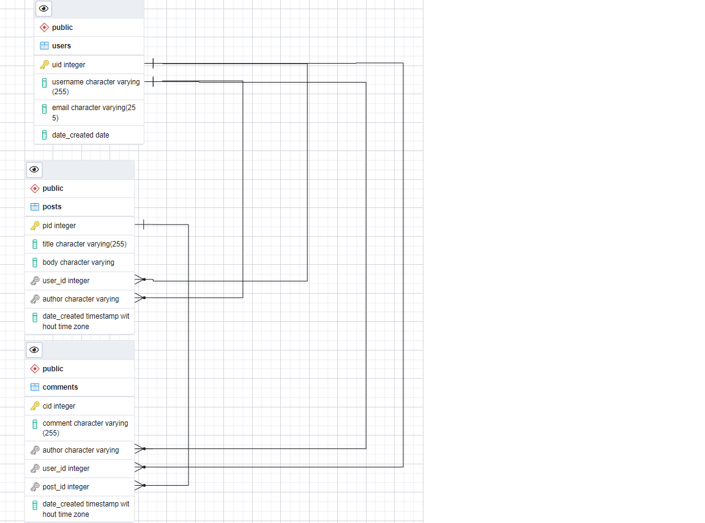
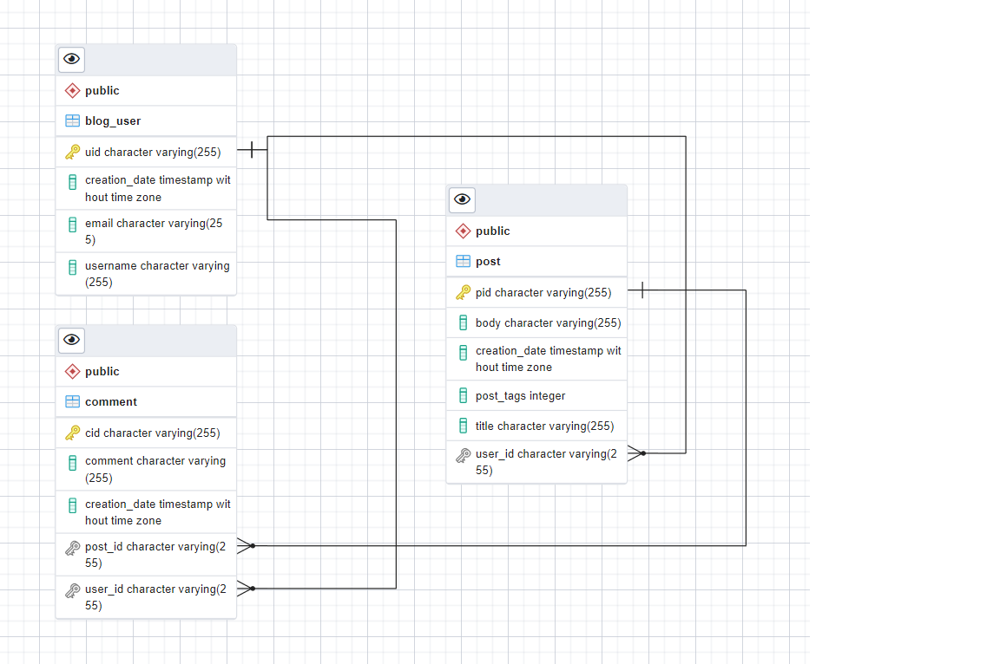
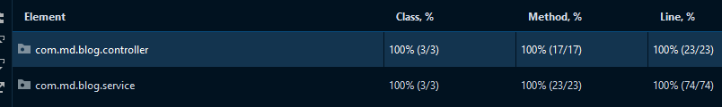
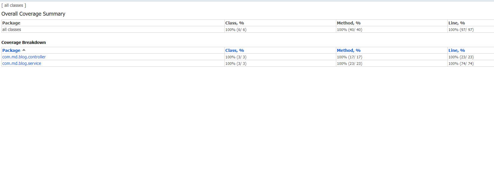
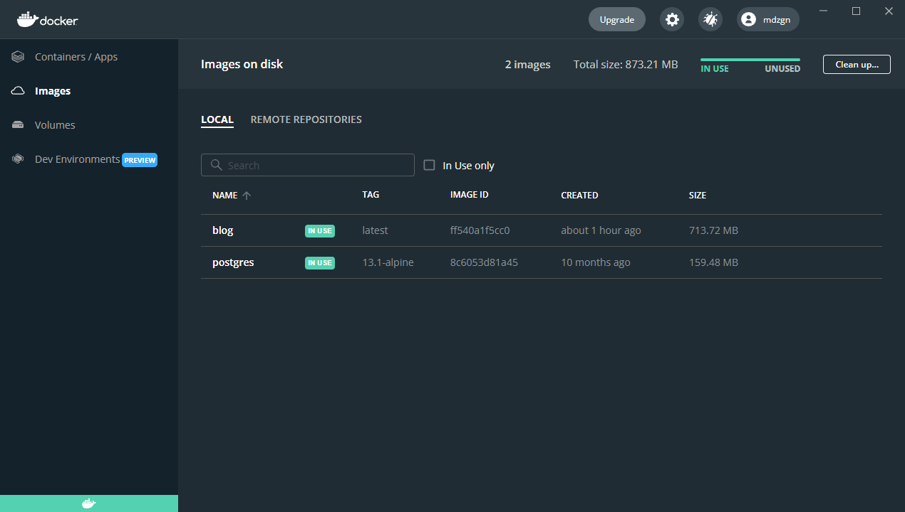
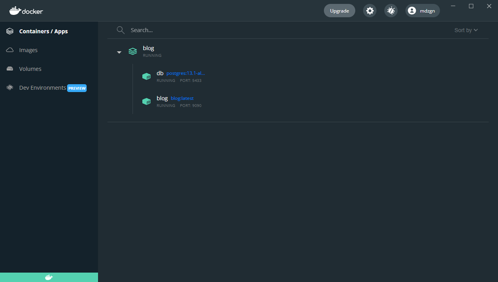

# Spring Boot Blog App

Spring boot kullanılarak yazılmış blog uygulaması 
## Teknolojiler

- Java 11
- Kotlin 1.5.31
- Spring Boot
- PostgreSQL
- H2 database
- Flyway
- Spring Data JPA
- OpenAPI
- Hateoas
- Docker
- JUnit 5
- Hamcrest
---
## Run It On Your Computer

### Project Setup With Maven

Projeyi klonlayın
```bash
  git clone https://github.com/Mduzgunn/blog
```

Proje dizinine gidin
```bash
  cd blog
```

Gerekli paketleri yükleyin
```bash
  mvn clean install
```

Projeyi çalıştırın
```bash
  mvn spring-boot:run
```

### Project Setup With Docker

Projeyi klonlayın
```bash
  git clone https://github.com/Mduzgunn/blog
```

Proje dizinine gidin
```bash
  cd blog
```

Docker image oluşturun
```bash
  docker build -t blog .
```

Docker containerları çalıştırın
```bash
  docker-compose up
```

http://localhost:9090 base url adresinin sonuna görmek istediğiniz API url'ini giriniz
```bash
  http://localhost:9090/v1/user
```
  ---
  
### [Open API-Swagger (go live)](https://bit.ly/3cKrFkv)

Proje ayağa kalktıktan sonra `http://localhost:8080/swagger-ui.html` adresinden swagger ile GET, POST, PUT, DELETE gibi isteklerde bulunabilirsiniz

---

## HTTP Methods and Functions 
### USER
```diff
🟢 GET 
📍 localhost:8080/v1/user --> (Kayıtlı bütün kullanıcıları getirme)

📍 localhost:8080/v1/user/id --> (Belirtilen id'ye sahip kullanıcıyı getirme)

🟢 POST 
📍 localhost:8080/v1/user --> (Kullanıcı oluşturma)

🟢 PUT
📍 localhost:8080/v1/user/id --> (Belirtilen id'ye sahip kullanıcıyı güncelleme)

🟢 DELETE
📍 localhost:8080/v1/user/id --> (Belirtilen id'ye sahip kullanıcıyı silme)

```
Spring HATEOAS
```diff
{
    "uid": "6e831384-19fb-45bd-80cc-243d8be94109",
    "username": "aaaaaaa",
    "email": "aaaaa@gmail.com",
    "posts": [
        {
            "pid": "d663e4cd-6998-4d8d-b70b-78fd07e16695",
            "title": "11111111111",
            "body": "postbody",
            "tags": "CODE",
            "creationDate": "2021-11-16T19:29:48.484903",
            "_links": {
                "self": {
                    "href": "http://localhost:8080/v1/post/d663e4cd-6998-4d8d-b70b-78fd07e16695"
                }
            }
        }
    ],
    "comments": [
        {
            "cid": "54d3c650-659a-4227-a528-f272e9c0f7fb",
            "comment": "comment message",
            "creationDate": "2021-11-20T19:47:13.232783",
            "_links": {
                "self": {
                    "href": "http://localhost:8080/v1/comment/54d3c650-659a-4227-a528-f272e9c0f7fb"
                }
            }
        }
    ]
}
```
### POST

```diff
🟣 GET 
📍 localhost:8080/v1/post --> (Kayıtlı bütün blog yazılarını getirme)

📍 localhost:8080/v1/post/id --> (Belirtilen id'ye sahip blog yazısını getirme)

🟣 POST 
📍 localhost:8080/v1/post --> (Blog yazısı oluşturma)

🟣 PUT 
📍 localhost:8080/v1/post/id --> (Belirtilen id'ye sahip blog yazısını güncelleme)

🟣 DELETE 
📍 localhost:8080/v1/post/id --> (Belirtilen id'ye sahip blog yazısını silme)

```
Spring HATEOAS
```diff
{
    "pid": "d663e4cd-6998-4d8d-b70b-78fd07e16695",
    "title": "11111111111",
    "body": "postbody",
    "tags": "CODE",
    "creationDate": "2021-11-16T19:29:48.484903",
    "author": {
        "uid": "6e831384-19fb-45bd-80cc-243d8be94109",
        "username": "aaaaaaa",
        "email": "aaaaa@gmail.com",
        "_links": {
            "self": {
                "href": "http://localhost:8080/v1/user/6e831384-19fb-45bd-80cc-243d8be94109"
            }
        }
    },
    "_links": {
        "self": {
            "href": "http://localhost:8080/v1/post/d663e4cd-6998-4d8d-b70b-78fd07e16695"
        }
    }
}
```

#### COMMENT
```diff
🟠 GET 
📍 localhost:8080/v1/comment --> (Kayıtlı bütün yorumları getirme)

📍 localhost:8080/v1/comment/id --> (Belirtilen id'ye sahip yorumu getirme)

🟠 POST 
📍 localhost:8080/v1/comment --> (Yorum oluşturma)

🟠 DELETE 
📍 localhost:8080/v1/comment/id --> (Belirtilen id'ye sahip yorumu silme)
```
Spring HATEOAS
```diff
[
    {
        "cid": "355be36f-efc1-49cb-a750-3c212132ae1e",
        "comment": "commentmesajı123",
        "creationDate": "2021-11-14T22:17:58.395548",
        "author": {
            "uid": "6e831384-19fb-45bd-80cc-243d8be94109",
            "username": "aaaaaaa",
            "email": "aaaaa@gmail.com",
            "links": [
                {
                    "rel": "self",
                    "href": "http://localhost:8080/v1/user/6e831384-19fb-45bd-80cc-243d8be94109"
                }
            ]
        },
        "links": [
            {
                "rel": "self",
                "href": "http://localhost:8080/v1/comment/355be36f-efc1-49cb-a750-3c212132ae1e"
            }
        ]
    }
]
```
---

## Görseller

##### Database Schemes






##### Coverage Test Results





##### Docker images and container




  
