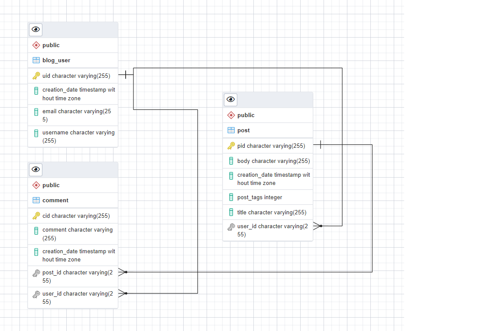
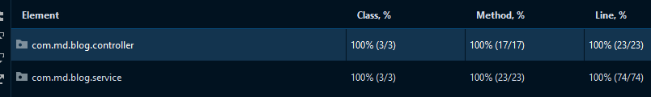
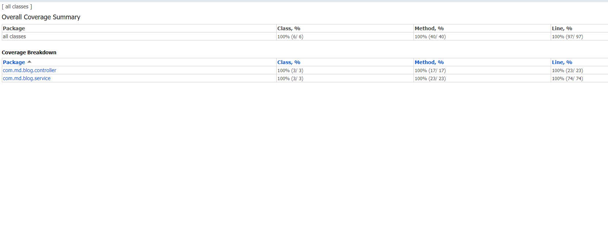

# Spring Boot Blog App

Kod Gemisi ve FolksDev beraberliğinde gerçekleştirilen bootcampe ait Spring Boot uygulaması
## Teknolojiler

- Java 11
- Kotlin 1.5.31
- Spring Boot
- PostgreSQL
- H2 database
- Flyway
- Spring Data JPA
- OpenAPI
- Hateoas
- Docker
- JUnit 5
- Hamcrest
## Run It On Your Computer

## Maven

Projeyi klonlayın

```bash
  git clone https://github.com/Mduzgunn/blog
```

Proje dizinine gidin

```bash
  cd blog
```

Gerekli paketleri yükleyin

```bash
  mvn clean install
```

Projeyi çalıştırın

```bash
  mvn spring-boot:run
```

## Docker

  
## HTTP Methods and Functions 
### USER
```diff
🟢 GET 
📍 localhost:8080/v1/user --> (Kayıtlı bütün kullanıcıları getirme)

📍 localhost:8080/v1/user/id --> (Belirtilen id'ye sahip kullanıcıyı getirme)

🟢 POST 
📍 localhost:8080/v1/user --> (Kullanıcı oluşturma)

🟢 PUT
📍 localhost:8080/v1/user/id --> (Belirtilen id'ye sahip kullanıcıyı güncelleme)

🟢 DELETE
📍 localhost:8080/v1/user/id --> (Belirtilen id'ye sahip kullanıcıyı silme)

```
### POST

```diff
🟣 GET 
📍 localhost:8080/v1/post --> (Kayıtlı bütün blog yazılarını getirme)

📍 localhost:8080/v1/post/id --> (Belirtilen id'ye sahip blog yazısını getirme)

🟣 POST 
📍 localhost:8080/v1/post --> (Blog yazısı oluşturma)

🟣 PUT 
📍 localhost:8080/v1/post/id --> (Belirtilen id'ye sahip blog yazısını güncelleme)

🟣 DELETE 
📍 localhost:8080/v1/post/id --> (Belirtilen id'ye sahip blog yazısını silme)

```

### COMMENT
```diff
🟠 GET 
📍 localhost:8080/v1/comment --> (Kayıtlı bütün yorumları getirme)

📍 localhost:8080/v1/comment/id --> (Belirtilen id'ye sahip yorumu getirme)

🟠 POST 
📍 localhost:8080/v1/comment --> (Yorum oluşturma)

🟠 DELETE 
📍 localhost:8080/v1/comment/id --> (Belirtilen id'ye sahip yorumu silme)
```
## Ekran Görüntüleri

##### Database Schemes




##### Coverage Test Results





  